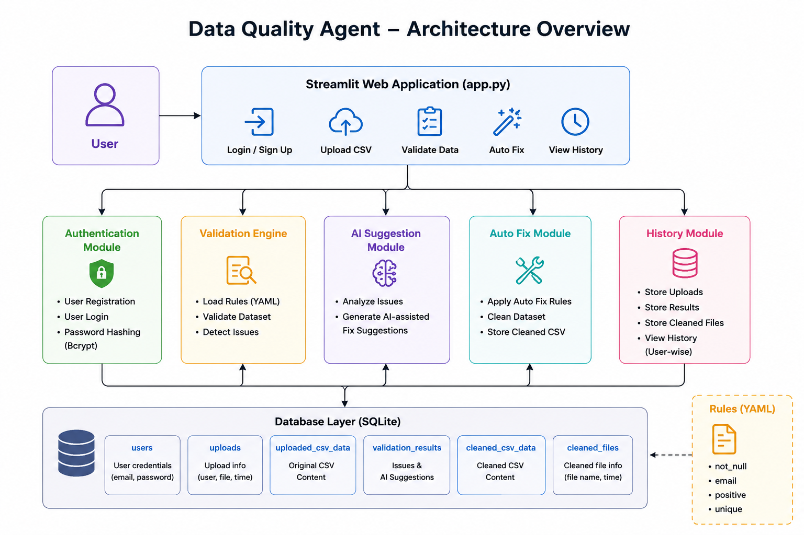

# 🚀 Data Quality Agent

A modern AI-assisted Data Quality Validation and Cleaning System built using Python, Streamlit, SQLite, Pandas, and YAML-based validation rules.

---

# 👥 Team Information

### Team Name

Team 7

### Team Number

Team 7

### Team Members

* Dinesh Ram R
* Dharun Adithya R
* Dhivya P
* Divya N

### Team Members Resumes

1. Dinesh Ram R - [Resume](<Resumes/Dinesh ram R 23IT012.pdf>)
2. Dharun Adithya R - [Resume](<Resumes/Dharun Adithya R 23CC010.pdf>)
3. Dhivya P - [Resume](<Resumes/Dhivya P 23AD036.pdf>)
4. Divya N - [Resume](<Resumes/DIVYA N_23AD037.pdf>)

---

# 🌐 Deliverable Links

### Live Deployment Link

Deployed Link :

https://data-quality-agent-s2eccxu2aus43cvgvpphwu.streamlit.app

### Demo Video

Demo Link:

https://www.loom.com/share/ca882d867af54f2dbd82d156ed621259

### GitHub Repository

https://github.com/DineshRam0127/Data-Quality-Agent

---

# 📌 Project Overview

Data Quality Agent helps users validate, detect, and automatically fix common data quality issues in CSV datasets.

The application performs:

* Missing Value Detection
* Invalid Email Detection
* Duplicate Record Detection
* Negative Value Detection
* AI-Assisted Fix Suggestions
* Automatic Dataset Cleaning
* User-wise Validation History Storage

---

# ✨ Features

## 🔐 User Authentication

* User Registration
* User Login
* Password Hashing using Bcrypt
* SQLite Database Storage

## 📂 Dataset Upload

* Upload CSV Files
* Preview Uploaded Dataset

## ✅ Data Validation

Validation Rules Supported:

* Not Null Validation
* Email Format Validation
* Positive Value Validation
* Duplicate Detection

## 🤖 AI-Assisted Suggestions

The system generates intelligent suggestions for resolving detected data quality issues.

## 🛠 Auto Dataset Cleaning

Automatically:

* Fills missing names
* Converts negative salary values to positive
* Removes duplicate emails

## 📜 Validation History

Stores:

* Uploaded Files
* Validation Reports
* Cleaned Datasets

History is visible only to the logged-in user.

---

# 🛠 Technology Stack

| Category         | Technology |
| ---------------- | ---------- |
| Frontend         | Streamlit  |
| Backend          | Python     |
| Database         | SQLite     |
| Authentication   | Bcrypt     |
| Data Processing  | Pandas     |
| Validation Rules | YAML       |
| Version Control  | GitHub     |

---

# 📁 Project Structure

DataQualityAgent/

├── app.py

├── auth/
│ └── database.py

├── agent/
│ ├── validator.py
│ ├── autofix.py
│ └── llm_helper.py

├── rules/
│ └── checks.yaml

├── data/
│ └── employee.csv

├── .streamlit/
│ └── config.toml

├── users.db

└── README.md

---

# 🏗 Architecture Diagram




---

# 🔄 System Workflow

1. User logs into the application.
2. User uploads a CSV dataset.
3. Validation engine loads YAML rules.
4. Dataset is validated against predefined rules.
5. Issues are detected and displayed.
6. AI-assisted suggestions are generated.
7. Auto Fix module cleans the dataset.
8. Results are stored in SQLite database.
9. User downloads cleaned dataset.
10. Validation history is maintained user-wise.

---

# 🚀 Setup Instructions

## Clone Repository

```bash
git clone https://github.com/DineshRam0127/Data-Quality-Agent.git
```

## Navigate to Project Folder

```bash
cd DataQualityAgent
```

## Create Virtual Environment

```bash
python -m venv venv
```

## Activate Virtual Environment

Windows

```bash
venv\Scripts\activate
```

## Install Dependencies

```bash
pip install streamlit pandas pyyaml bcrypt
```

## Run Application

```bash
streamlit run app.py
```

Application URL:

```text
http://localhost:8501
```

---

# 📋 Validation Rules Used

```yaml
checks:

  - column: name
    type: not_null

  - column: email
    type: email

  - column: salary
    type: positive

  - column: email
    type: unique
```

---

# 🧪 Sample Data

Location:

```text
data/employee.csv
```

The sample dataset demonstrates:

* Missing Value Detection
* Invalid Email Detection
* Duplicate Detection
* Salary Validation

---

# 🧪 Test Cases

## Test Case 1

Input:

```csv
name,email,salary
,dinesh@gmail.com,50000
```

Expected Result:

```text
name contains NULL values
```

## Test Case 2

Input:

```csv
name,email,salary
Dinesh,dineshgmail.com,50000
```

Expected Result:

```text
email contains invalid emails
```

## Test Case 3

Input:

```csv
name,email,salary
Dinesh,dinesh@gmail.com,-50000
```

Expected Result:

```text
salary should be positive
```

## Test Case 4

Input:

```csv
name,email,salary
Dinesh,dinesh@gmail.com,50000
John,dinesh@gmail.com,40000
```

Expected Result:

```text
email contains duplicates
```

---

# 🧠 Assumptions Made

* Input files are CSV datasets.
* Validation rules are predefined in YAML.
* Uploaded datasets fit into local memory.
* Users provide structured tabular data.
* SQLite is sufficient for local storage.
* Internet connection is not required for validation.

---

# ⚠ Limitations

* Supports CSV files only.
* Uses SQLite database.
* AI suggestions are rule-based.
* Validation rules are manually configured.
* Supports structured datasets only.

---

# 🔮 Future Enhancements

* Excel File Support
* LLM Integration
* Dynamic Rule Creation
* Advanced Data Profiling
* Cloud Deployment
* Role-Based Access Control
* Real-Time Data Monitoring

---

# 🤖 AI Usage Note

## AI Tools Used

* ChatGPT
* Claude AI

## What AI Helped With

* UI/UX Design
* Authentication System
* SQLite Integration
* Validation Logic
* Auto Fix Logic
* Debugging
* Documentation

## What AI Got Wrong

* Login Page Alignment Issues
* Signup Page Scrolling Issues
* Button Positioning Problems
* Validation History Visibility Bug

## Human Corrections

* Fixed Responsive Layout
* Improved Authentication Flow
* Added User-wise History Visibility
* Refined UI Styling

## Best Prompts Used

* Create modern Streamlit login page
* Build SQLite authentication system
* Fix Streamlit CSS alignment issues
* Create CSV validation engine
* Implement dataset auto-cleaning
* Design validation history module

---

# 🎥 Project Demonstration Video

Demo Link:

https://www.loom.com/share/ca882d867af54f2dbd82d156ed621259

The demonstration video includes:

* Project Overview
* Authentication Flow
* CSV Upload
* Validation Process
* AI Suggestions
* Auto Fix Functionality
* Validation History
* Architecture Explanation

---

# ✅ Project Outcome

Data Quality Agent successfully automates dataset validation and cleaning processes, helping users improve data quality with minimal manual effort.

---

# 👨‍💻 Developed By

Team number - 7

Project: Data Quality Agent
